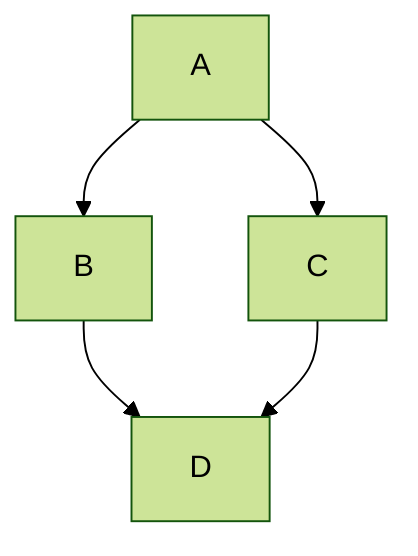
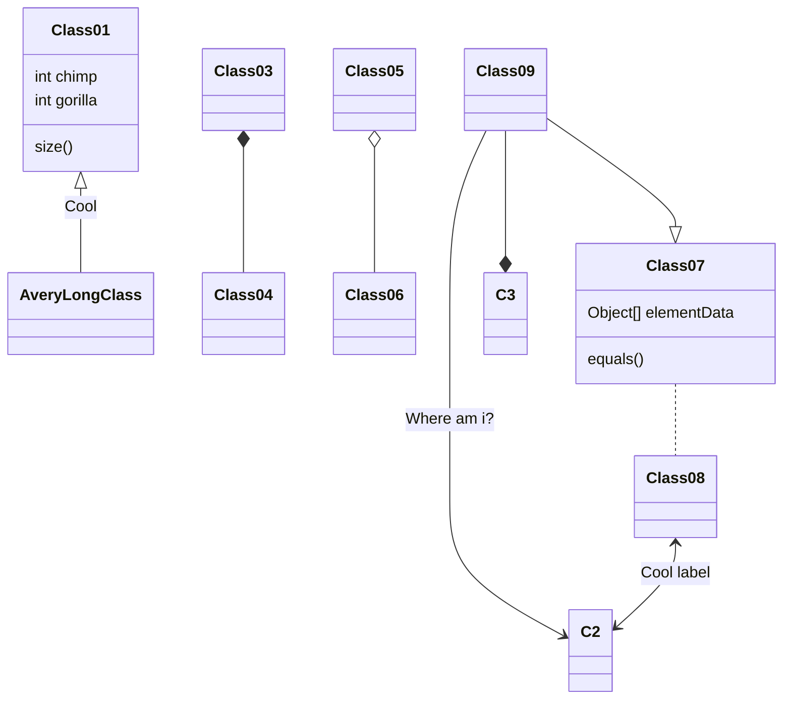

# Mermaid Example

````

```mermaid
graph TD;
    A-->B;
    A-->C;
    B-->D;
    C-->D;
```
````
上記の実行結果:

```mermaid
graph TD;
    A-->B;
    A-->C;
    B-->D;
    C-->D;
```

theme設定の`%%{init: { "theme": "forest" } }%%`の追加


```mermaid
%%{init: { "theme": "forest" } }%%
graph TD;
    A-->B;
    A-->C;
    B-->D;
    C-->D;
```
クラス図


```mermaid
classDiagram
Class01 <|-- AveryLongClass : Cool
Class03 *-- Class04
Class05 o-- Class06
Class07 .. Class08
Class09 --> C2 : Where am i?
Class09 --* C3
Class09 --|> Class07
Class07 : equals()
Class07 : Object[] elementData
Class01 : size()
Class01 : int chimp
Class01 : int gorilla
Class08 <--> C2: Cool label
```
