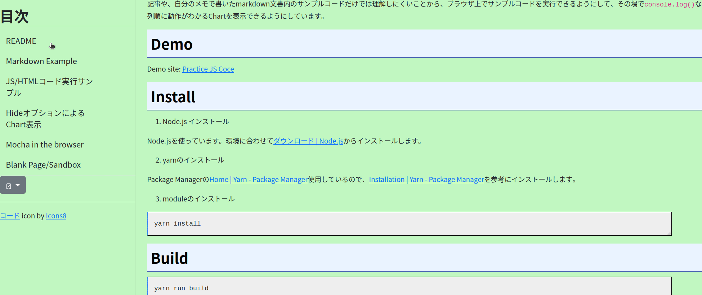
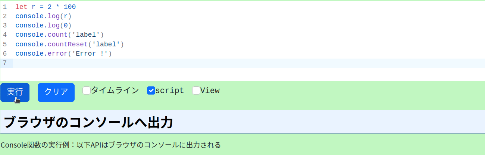
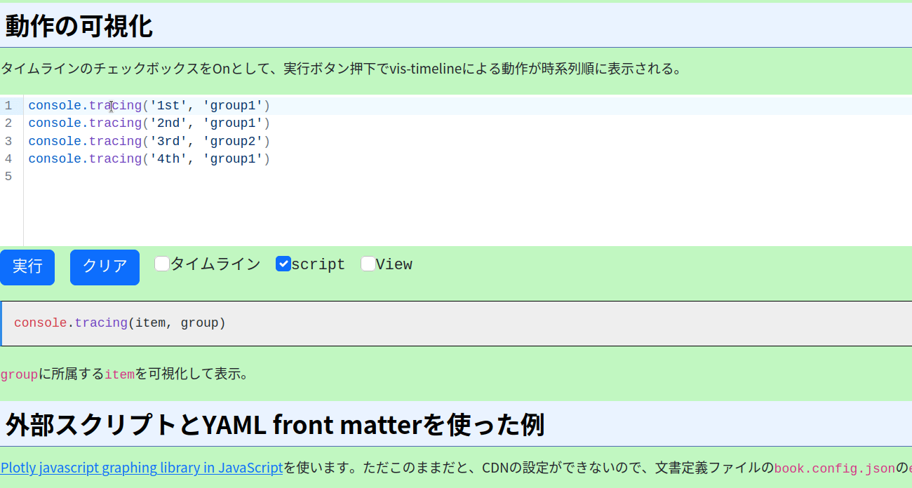
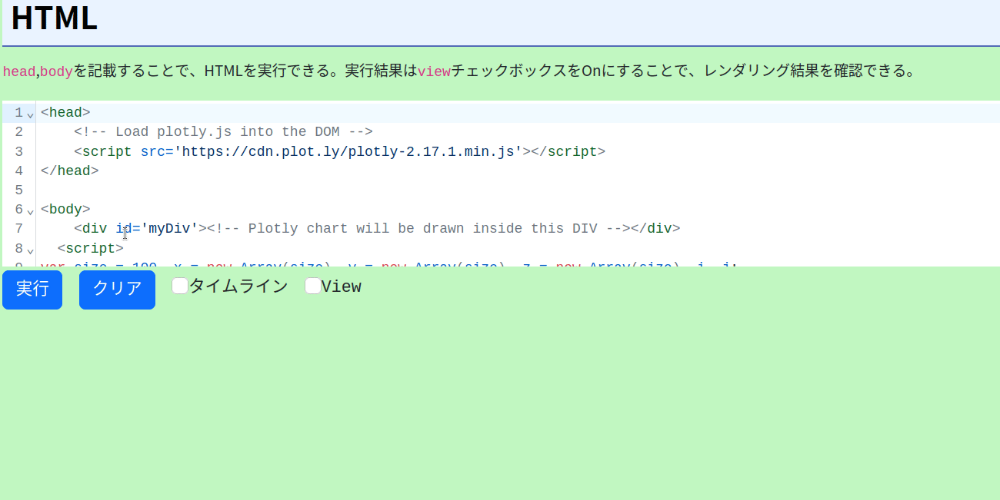

# Practice JS Code

Markdown文書を閲覧するViewerです。JavascriptやHTMLをその場で実行できます。



## 誰のため

将来の自分。もしくはJSの初心者のための反面教師として。

## 何をするもの

記事や、自分のメモで書いたmarkdown文書内のサンプルコードだけでは理解しにくいことから、ブラウザ上でサンプルコードを実行できるようにして、その場で`console.log()`などで実行結果を確認。また時系列順に動作がわかるChartを表示できるようにしています。

## Demo

Demo site: [Practice JS Coce](https://hkawa90.github.io/PracticeJSCode/)

## Install

1. Node.js インストール

Node.jsを使っています。環境に合わせて[ダウンロード | Node.js](https://nodejs.org/ja/download/)からインストールします。

2. pnpmのインストール

[Fast, disk space efficient package manager | pnpm](https://pnpm.io/ja/)を参考に導入してください。下記は`Linux`での例です。

```shell
$ curl -fsSL https://get.pnpm.io/install.sh | sh -
==> Downloading pnpm binaries 7.26.3
Copying pnpm CLI from /tmp/tmp.x5zfOs8vtV/pnpm to /home/kawa90/.local/share/pnpm/pnpm
Appended new lines to /home/kawa90/.bashrc

Next configuration changes were made:
export PNPM_HOME="/home/kawa90/.local/share/pnpm"
export PATH="$PNPM_HOME:$PATH"

To start using pnpm, run:
source /home/kawa90/.bashrc
$ source /home/kawa90/.bashrc
```

3. モジュールのインストール

パッケージマネージャの`pnpm`を使ってインストールします。

```shell
pnpm install
```

## Build

`pnpm`から`vite`を起動してビルドします.

```shell
pnpm build
```
## 実行

サンプル文書(Markdown)はdistファオルダにあります。そのまま実行する場合は以下を実行してブラウザで開く。ブラウザでは`http://localhost:8080/`をオープンします。

```shell
pnpm preview
```

また同梱のserverプログラムもあります。ブラウザでは`http://localhost:9999/`をオープンします。

``` shell
node ./server/index.mjs ./dist
```

## 特徴

markdown文書からWebページを生成します。fenced code blockのJavascriptをWebページで動作させて理解しやすくします。

* [azu/codemirror-console: Web Console UI for JavaScript.](https://github.com/azu/codemirror-console)を使用してMarkdown文書内のfenced code blockのJavascriptコードをWebページ上で実行。オリジナルはCM5を使用していたが、最新版の[CodeMirror](https://codemirror.net/)を使って実装した。また一部誤りなどを修正して使用している。



    * 実行ボタン押下でiframe内でJSを実行
    * console.log(), error,clear,count, countEndはコード下部に表示(console.debug,console.assert,console.dir,console.group,console.info,console.groupEndはブラウザコンソールへ出力)
    * ログ出力結果はクリアボタンで消去
    * Codemirror6によるコード編集
	＊`script`モードと、`module`モードがある。このモード切替は実行ボタン横のチェックボックスで行う。
	* `script`モードでは、JSコードは`eval()`で実行される。`module`モードでは`dynamic import`で読み込まれたモジュールとして実行される。このため、`strict`モードで動作する。

* [vis.js](https://visjs.org/)のTimelineを使って、fenced code blockのJSコードの動作を可視化。`console.tracing()`をコールしたときの情報を可視化している。



    * console.traing(item名称,group名称)をコード中に挿入して、`タイムライン`チェックボックスをOnすることで、時系列順にgraph表示されます。横軸は実際の時刻ではなく順番eとなっちます。ブラウザの時刻精度はセキュリティー上低くなっているので。
    
* JSコード実行では、[yaml - npm](https://www.npmjs.com/package/yaml)を使って、実行時の動作設定とローカル変数としてアクセス可能。YAML記法についての注意点があるので、下記を参考にしてください。


    * YAML Front matter(コード上部の`---`で囲まれた部分に記載)でJSコード実行時の動作制御ができます。また変数の初期値を設定できます。
    * YAMLでkeyの後のコロンの後にはスペースを入れてください。**これはYAMLの仕様です。**[YAML 構文 — Ansible Documentation](https://docs.ansible.com/ansible/2.9_ja/reference_appendices/YAMLSyntax.html)が参考になります。
    * `view`チェックボックスをonすることでDOMのレンダリング結果を表示できます。
    


    * HTMLも同様に実行できます。

* [jpn.css - Optimize typography in Japanese](https://kokushin.github.io/jpn.css/)を使用。
* fenced code blockで[Mermaid | Diagramming and charting tool](https://mermaid.js.org/)でdiagram表示


* CSSフレームワークの[Introduction · Bootstrap v5.0](https://getbootstrap.com/docs/5.0/getting-started/introduction/)を使用。Webページのレイアウトに[Bootstrap 5 Sidebar Examples - DEV Community 👩‍💻👨‍💻](https://dev.to/codeply/bootstrap-5-sidebar-examples-38pb)を参考にした。
* [markedjs/marked: A markdown parser and compiler. Built for speed.](https://github.com/markedjs/marked)でmarkdownをブラウザ上でHTMLへ変換
* 通常のfenced code blockは[highlight.js](https://highlightjs.org/)を使用

## コード実行

### JSコード実行

実行時動作の設定はYAML front matterにて`config`内容を変更することで動作を切り替えることができます。設定可能な一覧は下記の通り。

|item|内容|備考   |default|
|---|---|---|---|
|view|描画On/Off|boolean(On:true, Off:false)|false|
|autorun|自動実行|boolean(自動実行する:true, 自動実行しない:false)|false|
|hide|ソースコード表示On/Off|boolean(表示しない:true, 表示する:false)|false|
|timeline|時系列表示On/Off|boolean(On:true, Off:false)|false|
|script|実行モード|"script"or"module"|"script"|
|sandbox|iframe sandbox属性|string|allow-scripts allow-same-origin|

実際の設定例は以下の通り。指定がない項目は、デフォルト値で動作する。

```javascript
---
config: 
  view: true
  autorun: false
  hide: false
  timeline: false
  script: module
size: 50
---
console.log(size)
const button = document.createElement('button')
button.innerText = "button"
document.body.appendChild(button)
```
下記の内容がエラー出力されたら、`script`チェックボックスをOffとしてください。

```text
SyntaxError: await is only valid in async functions, async generators and modules
```
そうすると、次の`await`を含む[コード](https://web.dev/i18n/ja/storage-for-the-web/)を実行できます。

```javascript
if (navigator.storage && navigator.storage.estimate) {
  const quota = await navigator.storage.estimate();
  // quota.usage -> Number of bytes used.
  // quota.quota -> Maximum number of bytes available.
  const percentageUsed = (quota.usage / quota.quota) * 100;
  console.log(`You've used ${percentageUsed}% of the available storage.`);
  const remaining = quota.quota - quota.usage;
  console.log(`You can write up to ${remaining} more bytes.`);
}
```

### HTMLコード実行

`body`を除いた、`head`, `body`タグで構成された、HTMLコードを実行できる。`view`チェックボックONでレンダリング結果(iframe)が表示される。

## モジュール

### main.js

メインモジュールで、`mermaid`を`startOnLoad:false`で初期化。Markdownが変換できたら、`mermaid.init()`をコールしている。`style=didplay:none`を適用した要素以下に適用すると、mermaidはエラーとなる。

以降、Markdown文書のレンダリング、JSコード/HTMLコード実行環境を構築、ハイライト処理を実行する。

### CrtDoc.js

文書構造を定義した`book.config.json`を`fetch()`で読み込み、必要なMarkdown文書も読み込む。

`book.config.json`:

```json
{
    "title": "タイトルだぞ",
    "style": "custom.css",
    "cmTheme" : "materialLight",
    "chapters": [
        { "file": "/1.md", "name" : "第1章"},
        { "file": "/2.md", "name" : "第2章"},
        { "file": "/3.md", "name" : "サンプル"},
        { "file": "/4.md", "name" : "Timeline"}
    ]
}
```

markdown文書のHTML変換後は`id=CONTENTS`の配下に`appendChild`する。この時'id=chap-章番号-content'として、アクセス可能としている。また、HTMLから`h1,h2,h3,h4,h5,h6`を抽出して、TOC(目次)を作成して、左サイドバーに表示するようにしている。

### CodeMirrorRepl.js, context-eval.js

ほぼ[azu/codemirror-console: Web Console UI for JavaScript.](https://github.com/azu/codemirror-console)と同じだが、CMを最新版のV6に変更.scrpt, moduleなどに加えて、HTMLコードを実行できるように変更している。consoleのlog(),info(), warn(), error()に加えて、clear(),count(),countReset(),debug(),assert(),dir(),dirxml(),exception(),group(),groupCollapsed(),groupEnd(),profile(),profileEnd(),table(),time(),timeEnd(),timeStamp()を追加。

### bookmark.js

[Window.localStorage - Web API | MDN](https://developer.mozilla.org/ja/docs/Web/API/Window/localStorage)を使って、チャプタ情報とスクロール位置を記憶して、UIからその保存した位置の文書を表示します。注意点としてはlocalStorageはoriginに紐づくので、ポート番号などが変わってもアクセスができなくなります。`localStorage`はkey/value形式のため、アプリケーション名をkeyとして、ブックマーク情報をJSON化して保存します。読み取り時はその逆を行います。

## 文書作成方法

章毎のMarkdown文書を作成し、`dist`フォルダに`book.config.json`を作成し、文書タイトルと章毎にファイル名とタイトルを記載。ファイル名は`dist`配下の絶対パスで指定する。styleを変更したい場合は、`style`にカスタムCSSファイルを指定できる。カスタムCSSファイルは通常のCSSファイルと同じ。また同様に、`cmTheme`でCodeMirrorのthemeを設定できる。Theme名は[material](https://www.npmjs.com/package/@uiw/codemirror-themes-all)を参照。JSコードの実行に必要な外部スクリプト(CDN)がある場合は、`extScript`に指定する。

`book.config.json`の例:
```json
{
    "title": "Practice JS Coce",
    "style": "/custom.css",
    "cmTheme" : "materialLight",
    "extScript" : [
        "https://cdn.plot.ly/plotly-2.17.1.min.js"
    ],
    "chapters": [
        { "file": "/1.md", "name" : "README"},
        { "file": "/2.md", "name" : "Mermaid Example"},
        { "file": "/3.md", "name" : "JSコード実行サンプル"},
        { "file": "/4.md", "name" : "HTMLコード実行サンプル"}
    ]
}
```

コード実行させたいJavascript codeでは下記のように言語指定で`pjs`とします。

````javascript
```pjs
console.log(1)
```
````

実行させたいHTMLでは下記のように言語指定で`phtml`とします。

````javascript
```phtml
<head>
	<!-- Load plotly.js into the DOM -->
	<script src='https://cdn.plot.ly/plotly-2.17.1.min.js'></script>
</head>

<body>
	<div id='myDiv'><!-- Plotly chart will be drawn inside this DIV --></div>
  <script>
var size = 100, x = new Array(size), y = new Array(size), z = new Array(size), i, j;

for(var i = 0; i < size; i++) {
	x[i] = y[i] = -2 * Math.PI + 4 * Math.PI * i / size;
  	z[i] = new Array(size);
}

for(var i = 0; i < size; i++) {
  	for(j = 0; j < size; j++) {
    	var r2 = x[i]*x[i] + y[j]*y[j];
    	z[i][j] = Math.sin(x[i]) * Math.cos(y[j]) * Math.sin(r2) / Math.log(r2+1);
 	}
}

var data = [ {
		z: z,
		x: x,
		y: y,
		type: 'contour'
	}
];

Plotly.newPlot('myDiv', data);

  </script>
</body>
```
````
mermaidで表示させたい場合は、下記のように言語指定で`mermaid`とします。

````javascript

````

fenced code blockの戦闘にYAML front matterでmetadataを設定できます。ただ現在は反映されません。

````javascript
---
comment: "メモです"
---
```pjs
console.log(1)
```
````

あとはMarkdownに従います。

## Vite移行について

下記を参考に諸設定

- [Vite + vanilla-ts+SCSS環境を作る](https://zenn.dev/one_dock/articles/f694d8235cd388)
- [プラグインの使用 | Vite](https://ja.vitejs.dev/guide/using-plugins.html)

[Vite | 次世代フロントエンドツール](https://ja.vitejs.dev/)を参考に導入

```shell
$ pnpm create vite my-vue-app --template vanilla
$ cd my-vue-app
$ pnpm install
$ pnpm dev
  VITE v4.1.1  ready in 584 ms

  ➜  Local:   http://localhost:5173/
  ➜  Network: use --host to expose
  ➜  press h to show help
```

インストール後のディレクトリ構成:

```shell
.
├── counter.js
├── index.html
├── javascript.svg
├── main.js
├── node_modules
│   └── vite -> .pnpm/vite@4.1.1/node_modules/vite
├── package.json
├── pnpm-lock.yaml
├── public
│   └── vite.svg
└── style.css
```

`package.json`の`scripts`:

```json
{
  "scripts": {
    "dev": "vite", // 開発サーバを起動。エイリアス: `vite dev`, `vite serve`
    "build": "vite build", // プロダクション用にビルド
    "preview": "vite preview" // プロダクション用ビルドをローカルでプレビュー
  }
}
```

bootstrap5の導入:

```shell
pnpm add bootstrap @popperjs/core
pnpm add -D sass autoprefixer postcss
```

autoprefixer:

```text
last 2 versions
android >= 4
iOS >= 10
not dead
```
vite.config.js: 最終版は実ファイルを参照してください。

```javascript
import { defineConfig } from "vite";
import autoprefixer from "autoprefixer";

export default defineConfig(({ command }) => {
  if (command === "serve") {
    //開発環境設定
    return {
      server: {
        port: 8000,
      },
    };
  } else {
    //本番環境設定
    return {
      css: {
        postcss: {
          plugins: [autoprefixer],
        },
      },
    };
  }
});
```

`pnpm add`の結果`umet peer`となる。正しい動作にならない場合があるので解消しておく。

```text
 WARN  Issues with peer dependencies found
.
├─┬ vis-data 7.1.4
│ └── ✕ unmet peer uuid@"^7.0.0 || ^8.0.0": found 9.0.0
└─┬ vis-timeline 7.7.0
  └── ✕ unmet peer uuid@"^3.4.0 || ^7.0.0 || ^8.0.0": found 9.0.0
```

unmet peerを解消:

正確なところは不明だが、Webpack5より早くなった気がする。また設定ファイルの記述が簡単に。ただ`require`の変換がうまく行かず、js-yaml-front-matterをyamlパッケージに変更して使っている。
